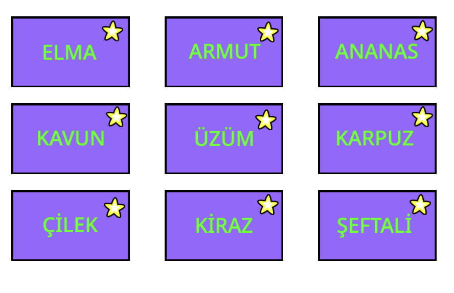
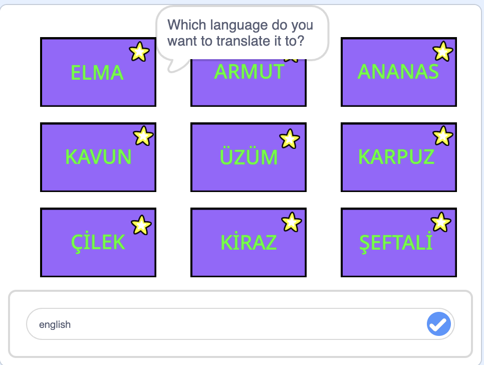
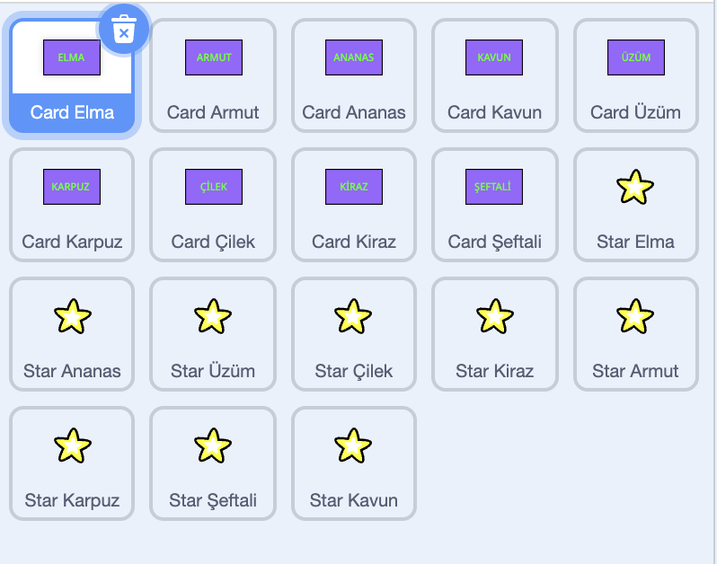
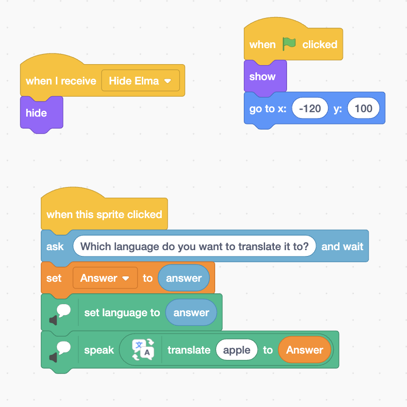
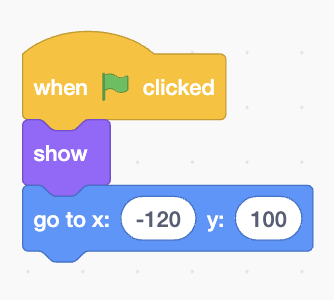
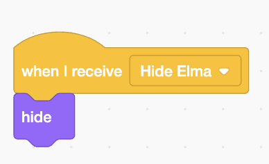

# Translation Project with Scratch
In this project, as a group, we designed a translation game by using Scratch. In this game, there are some cards and some Turkish words on them. When clicked on them, the card asks you which language to translate the word it to. When you type the language, it speaks out the translated version of the word that is written on the card. Also, when clicked on the star symbol on each card, the card disappears. The aim of this project is to teach the pronunciation of some words to someone who seeks to develop their pronunciation skills in a certain language. 

The following image shows how the cards look like. The words are fruits in Turkish. 

The following image shows what happens when a card is clicked. Essentially, a bubble shows up saying "Which language do you want to translate it to?", and a search button shows up. When the intended language is typed, the translator tells the translated version of the word written on the card.

The following image shows the sprites. There is a single sprite and its corresponding star for each card. 

The following image shows the codes for a card. They are very simple and applicable.

The following code segment makes our card seen and directs it to a default position when the flag is clicked.

The following code segment hides the card when "Hide Elma" is broadcasted. I will explain where that broadcast comes from :)

The following code segment provides us with the necessarry tools for the translation. The code with the blue background allows the search button to show up. The first code with the green background sets the language of what is written on the search button since we want it to speak in an accent of the language that it translates the word into. For example, we wouldn't want it to tell apple with a Turkish accent. Then, the second code with the green background speaks the translation of the word (apple in this case) according to the answer given on the search button. We used the "Text to Speech" and the "Translate" extensions of Scratch. We learned about the "Translator" extension from a YouTube [video] (https://www.youtube.com/watch?v=7DTIPYLy-_U) and modified it according to our project. 
