# Translation Project with Scratch
In this project, as a group, we designed a translation game by using Scratch. To play the game, click [here](https://scratch.mit.edu/projects/1068090239). In this game, there are some cards and some Turkish words on them. When clicked on them, the card asks you which language to translate the word it to. When you type the language, it speaks out the translated version of the word that is written on the card. Also, when clicked on the star symbol on each card, the card disappears. The aim of this project is to teach the pronunciation of some words to someone who seeks to develop their pronunciation skills in a certain language. 

The following image shows how the cards look like. The words are fruits in Turkish. 

The following image shows what happens when a card is clicked. Essentially, a bubble shows up saying "Which language do you want to translate it to?", and a search button shows up. When the intended language is typed, the translator tells the translated version of the word written on the card.

The following image shows the sprites. There is a single sprite and its corresponding star for each card. 

The following image shows the codes for a card. They are very simple and applicable.

The following code segment makes our card seen and directs it to a default position when the flag is clicked.

The following code segment hides the card when "Hide Elma" is broadcasted. I will explain where that broadcast comes from :)

The following code segment provides us with the necessarry tools for the translation. The code with the blue background allows the search button to show up. The first code with the green background sets the language of what is written on the search button since we want it to speak in an accent of the language that it translates the word into. For example, we wouldn't want it to tell apple with a Turkish accent. Then, the second code with the green background speaks the translation of the word (apple in this case) according to the answer given on the search button. We used the "Text to Speech" and the "Translate" extensions of Scratch. We learned about the "Translator" extension from a YouTube [video](https://www.youtube.com/watch?v=7DTIPYLy-_U) and modified it according to our project. 

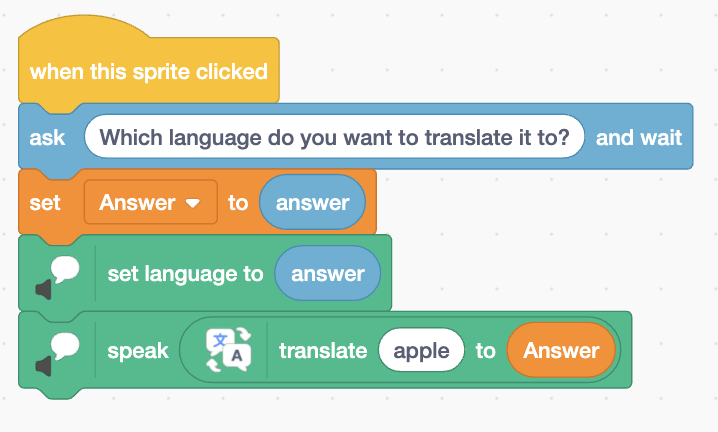

The following image shows the codes for a Star sprite.

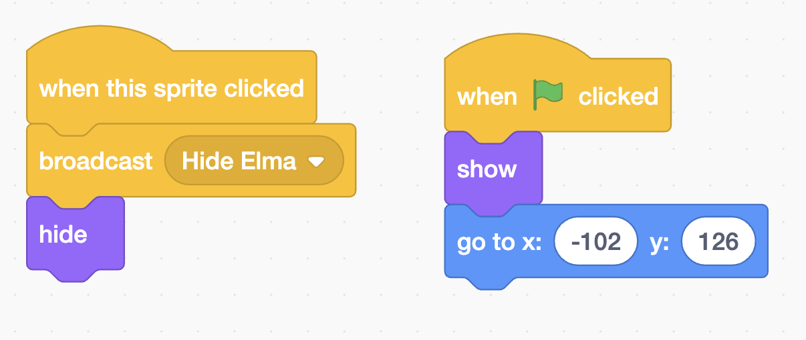

The following image shows that when a star is clicked, it broadcasts Hide. This broadcast is then used by the corresponding card to hide itself. Also, the purple "hide" block allows the star to hide itself too.

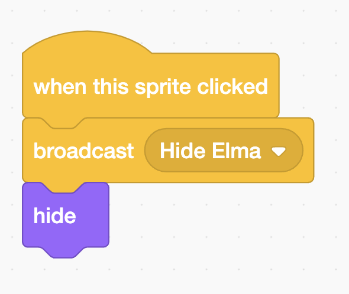

The following image makes the star visible and directs it to a certain position when the flag is clicked.

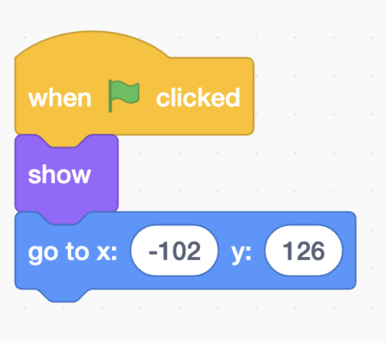

# Matching Card Game with Scratch
In this project, I designed a matching card game using Scratch. To play the game click [here](https://scratch.mit.edu/projects/1068091831). The aim is to find the same fruits. When you find the same fruits, they will disappear. If you cannot match them, you should try again. I used the first three parts of a [YouTube playlist](https://www.youtube.com/playlist?list=PL-ToYOfDx961iRXO5Yu4IfYFbvf0WKVq1) to make this project. I will try to explain a lot of complex blocks in a simple way, so I will skip some blocks or explain some parts superficially for the purpose of this website. For example, I will not talk about the effects in order not to explain a minor information in addition to the blocks that are actually making the game possible. 

The starting page looks like the following.

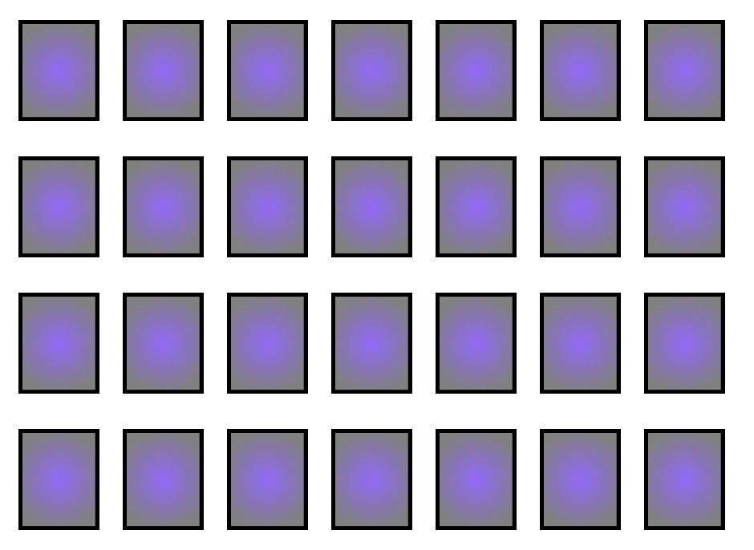

The costumes are the following. There is a blank custom for the cards' back face, and four different fruits.

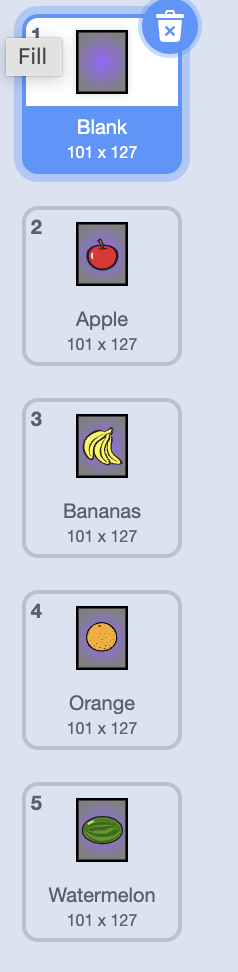

All the codes can be seen in the following image.

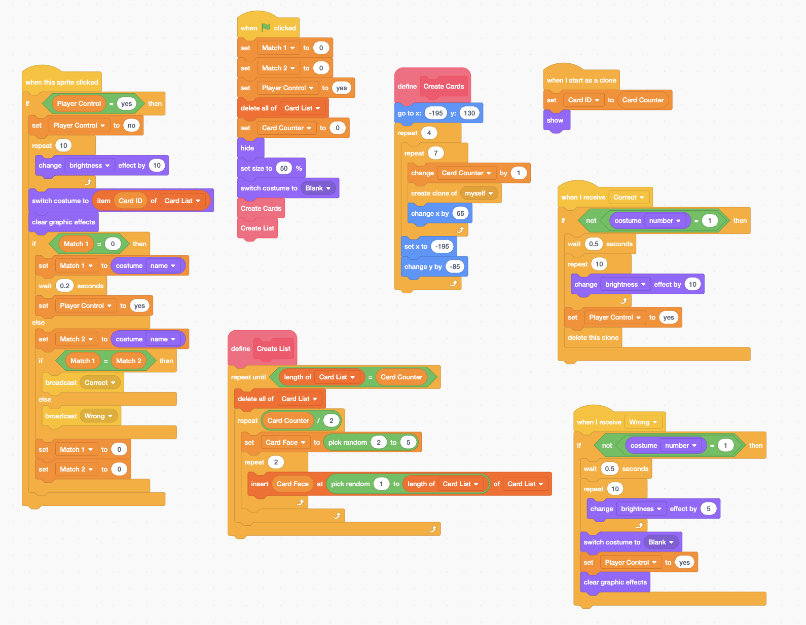

The following image shows the blocks when the flag is clicked. We set Match 1 and Match 2 to 0, and Player Control to "yes" which I will explain their purposes later. "Switch costume to Blank" allows all the cards to be blank. The variable "Card Counter" allows us to count the number of cards in the game. It is set 0 initially as there is no card now. Then, the image shows that the blocks create two blocks named "Create Cards" and "Create List", which I will explain their functions later. 

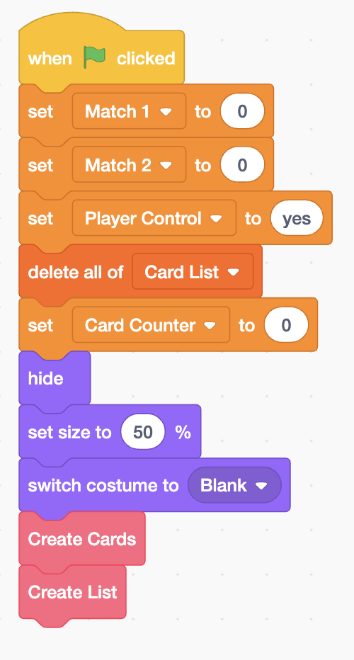

The following image defines the "Create Cards" block. As its name implies, these blocks are used to create cards in certain positions. "Change Card Counter by 1" allows us to keep track of the number of cards created. 

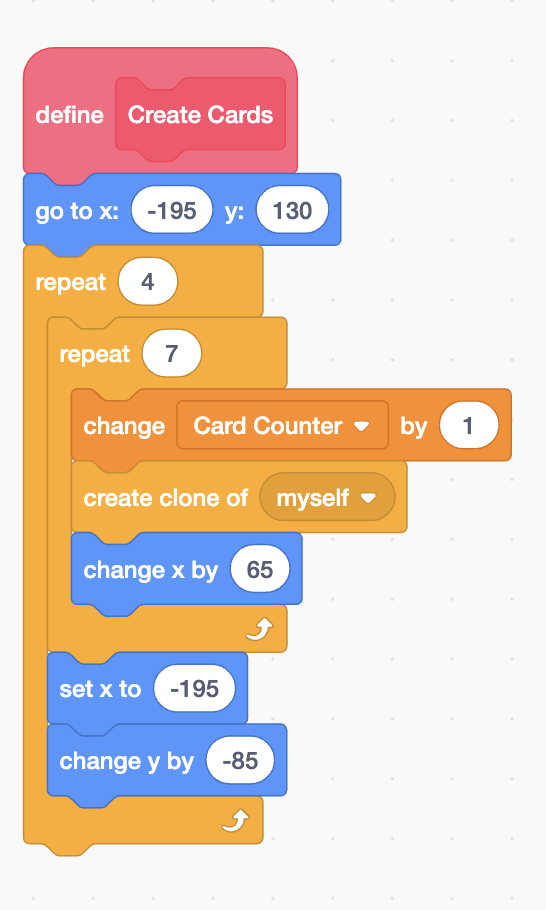

The following blocks show a card when it is cloned (created) in the previous image. Also, "set Card ID to Card Counter" allows each card to be assigned to a number so that we could match the card with its number. 

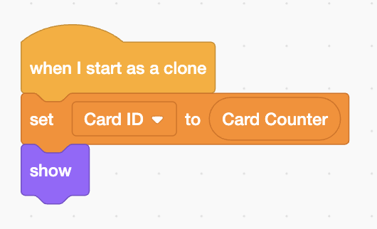

The following image defines "Create List" block. It assigns the lenght of the list to the number of cards, which is the value of the Card Counter (28). It repeats creating a list of cards 14 (Card Counter / 2) times since every fruit should have a duplicate somewhere so that we can match them. Then, it sets the Card Face to a random number from 2 to 5, which are the numbers of our costumes, and inserts them to a random location from the Card List. It repeats this process twice so that we could duplicate a card somewhere else. 

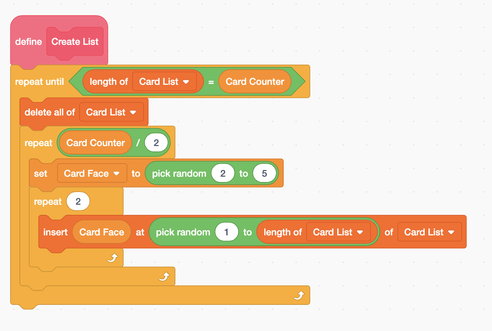

The following image basically allows us to broadcast either "Correct" if the cards are the same or "Wrong" if the cards are different. The "Switch costume to item Card ID of Card List" block gives the costume a name from the Card ID of Card List when the costume is clicked. But the key to understand these bunches of blocks is to understand the variables "Match 1" and "Match 2". We had set them 0 in our first image. So, if we imagine a scenario in which there is no card clicked yet, Match 1 and Match 2 should be 0. So, according to our if-then statement, it sets Match 1 to its corresponding costume name. After I click on another card, since Match is now not equal to 0, our code performs the else part of our if-then statement. This part sets Match 2 to its corresponding name. Now both of our cards have their corresponding name. If these names are the same, our code broadcasts "Correct". Otherwise, it broadcasts "Wrong". Eventually, it sets both Match 1 and Match 2 to 0 so that the same code will be applied when new cards are selected. You may wonder why we use the variable Player Control. Actually, it is the variable that allows all of these actions to happen as it can be seen at the top of the if statement. Player Control should be "yes" for us to click on a card. As we have seen in the first image, it is set "yes" initially, so we can click on the cards at the beginning of the game. Immediatly after we click on a card, it turns into "no". There are two possible scenarios for it to be set "yes" again. First, if there is currently no card selected, it does not turn into "yes" until Match 1 is given a costume name. This actually makes sure that we could click on another card to find a match for the first card after the first card is assigned a costume name. Second, if we have already selected our first card and are currently selecting our second card, then it does not turn into "yes" until the cards are deleted if they are the same, or until the cards get back to their blank states if they are different. So, this "Player Control" variable allows us to play the game smoothly. 

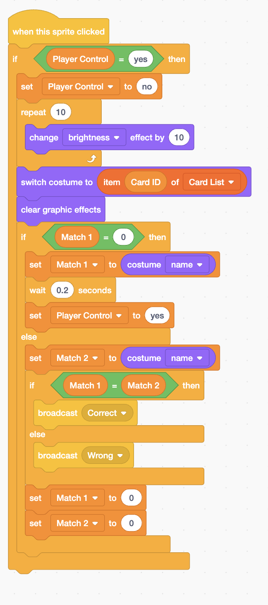

The following image performs action when it receives the "Correct" broadcast. Basically, it says that if the same cards are not the number 1 card (our blank card), then they will dissapear. This makes sure that our blank cards do not dissapear for no reason. 

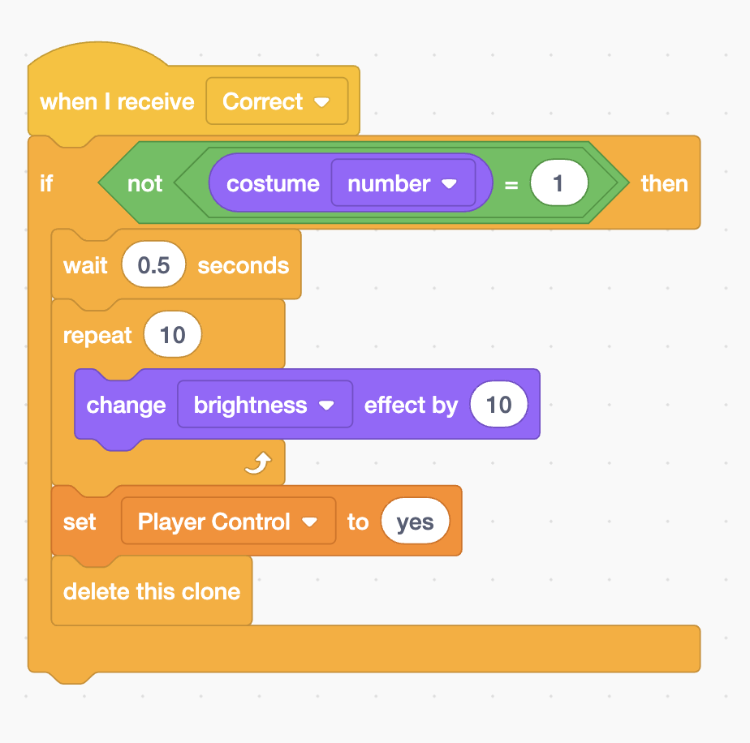

The following image performs action when it receives the "Wrong" broadcast. Just like the previous blocks, this bunch of blocks indicates that if the same cards are not the number 1 card (our blank card), then they will turn into our blank card.

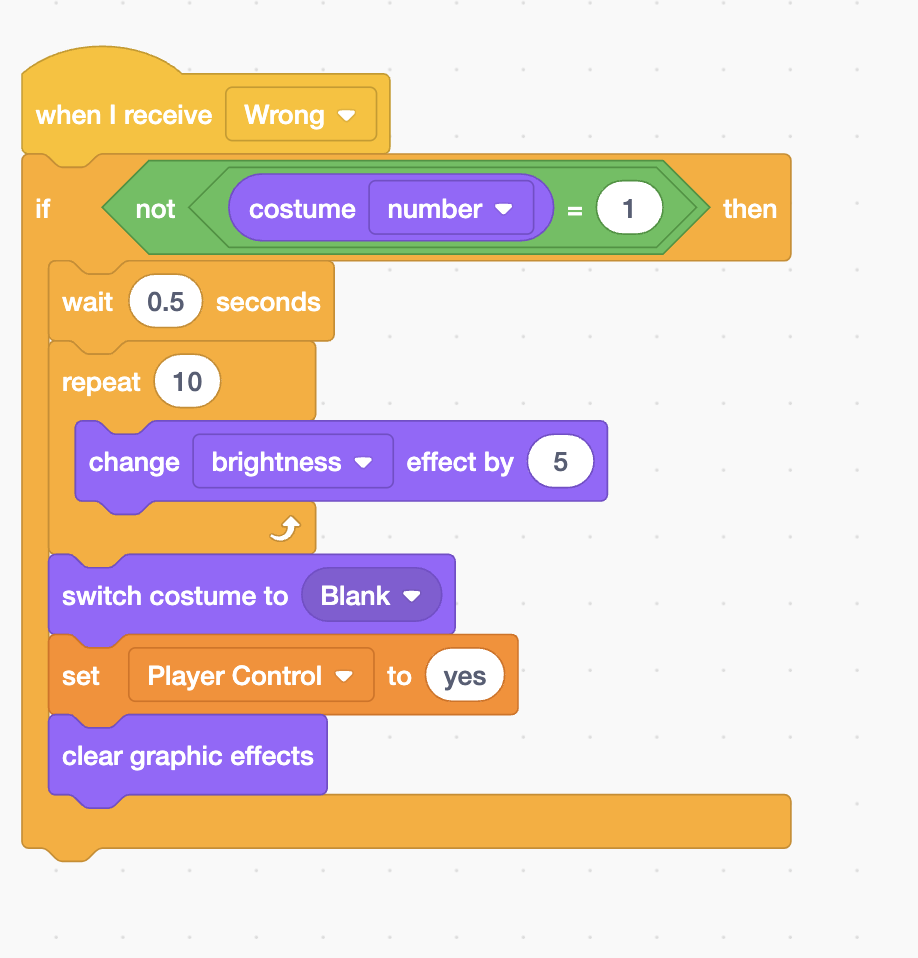

# Creating Dog Class
In this project, we were asked to write a Dog class that would allow us to create a new Dog object, set its age, and compare the ages of two Dog objects.

The following is the Dog class:

