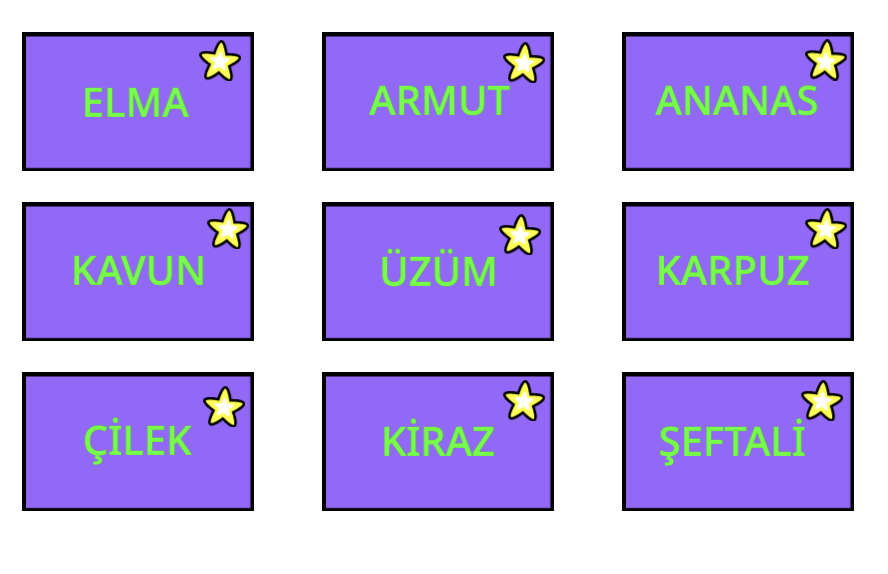

# Translation Project with Scratch
In this project, as a group, we designed a translation game by using Scratch. In this game, there are some cards and some Turkish words on them. When clicked on them, the card asks you which language to translate the word it to. When you type the language, it speaks out the translated version of the word that is written on the card. Also, when clicked on the star symbol on each card, the card disappears. The aim of this project is to teach the pronunciation of some words to someone who seeks to develop their pronunciation skills in a certain language. 

 
